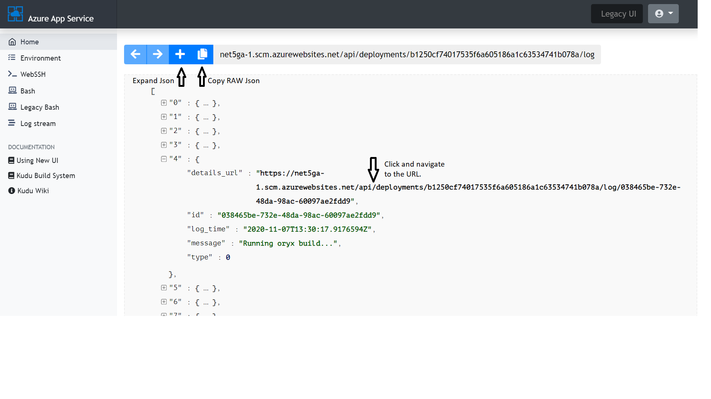

KuduLite has a new Look! Here's how the old Interface maps to the new one.

The raw Kudu APIs are still available at `/api/<>` but the newui now opens a JSON viewer to enable users to read the json api data easily. These api links can be found at:

The JSON View provides the functionality to expand the complete json, copy it and move to a linked json embedded in the current json.

The users can also access the logs for the latest deployment by clicking button on the top right corner of the Kudu home page.

Switching back to the legacy UI:

Users can switch back to the legacy UI by clicking the button on top (this setting is not sticky across the sessions).

Users can switch back to new UI by browsing to `/newui`

Kudu Bash:
Kudu Bash is now uses the same code path as WebSSH to the webapp. This provides a much smoother experience and fixes problems like auto-complete not working on the Bash console. The default shell for Kudu Bash is `sh`, list of available shells can be listed by `cat /etc/shells`

Please create a new issue, if you find any bugs. Happy deploying!